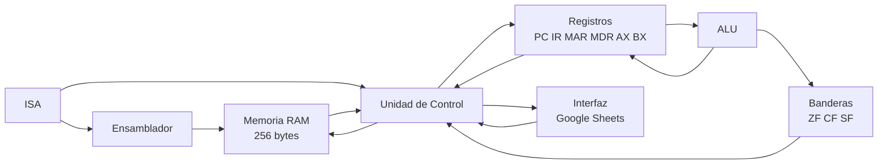

# Simulador de CPU de 8 bits

Simulador interactivo de una CPU de 8 bits basado en la arquitectura de Von Neumann, desarrollado utilizando Google Sheets y Google Apps Script.

El proyecto permite visualizar el funcionamiento de los principales componentes de una CPU y ejecutar instrucciones mediante el ciclo:

**Fetch -> Decode -> Execute -> Store**

---

## Plataforma

El proyecto fue desarrollado usando:

- Google Sheets
- Google Apps Script
- JavaScript
- GitHub
- GitHub Projects

Google Sheets funciona como interfaz visual del simulador, mientras que Google Apps Script implementa la lógica de la CPU, memoria, ALU, unidad de control, ensamblador e interfaz.

---

## Objetivo

Simular el funcionamiento básico de una CPU de 8 bits, incluyendo memoria principal, registros, ALU, unidad de control, banderas y el ciclo de instrucción Fetch-Decode-Execute-Store.

El simulador permite observar paso a paso los cambios producidos en los registros, banderas y memoria durante la ejecución de un programa.

---

## Arquitectura del simulador

El simulador está dividido en diferentes módulos:

- CPU
- Memoria RAM
- ALU
- Unidad de Control
- ISA
- Ensamblador
- Interfaz
- Pruebas

Esta separación permite mantener una arquitectura modular y facilita la modificación de los componentes del simulador.



---

## Memoria RAM

El simulador utiliza una memoria principal de **256 posiciones**, correspondiente al rango de direcciones:

```text
00H - FFH
```

Cada posición almacena un valor de 8 bits:

```text
00000000 - 11111111
```

La memoria se divide visualmente en dos segmentos:

| Rango | Tipo |
|---|---|
| 00H - 7FH | CODE |
| 80H - FFH | DATA |

El segmento `CODE` contiene los bytes correspondientes al programa.

El segmento `DATA` se utiliza para almacenar datos durante la ejecución.

La memoria permite visualizar:

- dirección;
- valor hexadecimal;
- representación binaria;
- tipo de segmento;
- mnemónico asociado cuando corresponde.

Las operaciones principales implementadas son:

- `Read(address)`
- `Write(address, value)`

Los valores almacenados están limitados al rango de 8 bits:

```text
0 - 255
```

---

## Registros del CPU

La CPU utiliza los siguientes registros:

| Registro | Función |
|---|---|
| PC | Program Counter. Indica la dirección de la siguiente instrucción |
| IR | Instruction Register. Contiene el opcode de la instrucción actual |
| MAR | Memory Address Register. Mantiene la dirección utilizada durante el acceso a memoria |
| MDR | Memory Data Register. Contiene el dato leído o escrito durante el acceso a memoria |
| AX | Registro de propósito general y acumulador |
| BX | Registro de propósito general |

Todos los registros utilizan valores de **8 bits**.

---

## Banderas

La CPU implementa tres banderas:

| Bandera | Descripción |
|---|---|
| ZF | Zero Flag. Se activa cuando el resultado es cero |
| CF | Carry Flag. Indica acarreo o préstamo según la operación |
| SF | Sign Flag. Representa el bit más significativo del resultado |

Las banderas son actualizadas por las operaciones correspondientes de la ALU y por instrucciones como `CMP`.

---

## ALU

La Unidad Aritmético-Lógica implementa operaciones aritméticas y lógicas.

### Operaciones aritméticas

- ADD
- SUB
- INC
- DEC
- CMP

### Operaciones lógicas

- AND
- OR
- XOR
- NOT

Los resultados son tratados como valores de 8 bits y las operaciones actualizan las banderas correspondientes.

---

## Ciclo de instrucción

Cada instrucción pasa por cuatro fases:

### FETCH

La CPU obtiene el opcode directamente desde la memoria RAM.

Las micro-operaciones principales son:

```text
PC -> MAR
RAM[MAR] -> MDR
MDR -> IR
PC <- PC + 1
```

Cuando la instrucción requiere un segundo byte, este también se obtiene desde RAM utilizando MAR y MDR.

### DECODE

La Unidad de Control interpreta el opcode almacenado en `IR`.

A partir de la tabla ISA se determina:

- instrucción;
- cantidad de bytes;
- operandos;
- tipo de operando;
- operación que debe ejecutarse.

Ejemplo:

```text
MOV AX, 5
```

se identifica como una instrucción `MOV` con un registro destino y un valor inmediato.

### EXECUTE

Se ejecuta la operación correspondiente.

Dependiendo de la instrucción, pueden intervenir:

- ALU;
- registros;
- banderas;
- memoria;
- Program Counter.

### STORE

El resultado de la operación es almacenado en el registro o posición de memoria correspondiente.

---

## ISA implementada

El simulador utiliza una ISA propia.

### Transferencia de datos

| Opcode | Instrucción | Bytes |
|---|---|---:|
| 10H | MOV AX, imm | 2 |
| 11H | MOV BX, imm | 2 |
| 12H | MOV AX, BX | 1 |
| 13H | MOV BX, AX | 1 |
| 20H | LOAD AX, [addr] | 2 |
| 21H | LOAD BX, [addr] | 2 |
| 22H | STORE [addr], AX | 2 |
| 23H | STORE [addr], BX | 2 |

### Operaciones aritméticas

| Opcode | Instrucción | Bytes |
|---|---|---:|
| 30H | ADD AX, imm | 2 |
| 31H | ADD BX, imm | 2 |
| 32H | ADD AX, BX | 1 |
| 33H | ADD BX, AX | 1 |
| 34H | SUB AX, imm | 2 |
| 35H | SUB BX, imm | 2 |
| 36H | SUB AX, BX | 1 |
| 37H | SUB BX, AX | 1 |
| 40H | CMP AX, imm | 2 |
| 41H | CMP BX, imm | 2 |
| 42H | CMP AX, BX | 1 |
| 43H | CMP BX, AX | 1 |
| 50H | INC AX | 1 |
| 51H | INC BX | 1 |
| 52H | DEC AX | 1 |
| 53H | DEC BX | 1 |

### Control de flujo

| Opcode | Instrucción | Bytes |
|---|---|---:|
| 60H | JMP addr | 2 |
| 61H | JZ addr | 2 |
| 62H | JNZ addr | 2 |
| 00H | HLT | 1 |

### Operaciones lógicas

| Opcode | Instrucción | Bytes |
|---|---|---:|
| 70H | AND AX, imm | 2 |
| 71H | AND BX, imm | 2 |
| 72H | AND AX, BX | 1 |
| 73H | AND BX, AX | 1 |
| 74H | OR AX, imm | 2 |
| 75H | OR BX, imm | 2 |
| 76H | OR AX, BX | 1 |
| 77H | OR BX, AX | 1 |
| 78H | XOR AX, imm | 2 |
| 79H | XOR BX, imm | 2 |
| 7AH | XOR AX, BX | 1 |
| 7BH | XOR BX, AX | 1 |
| 7CH | NOT AX | 1 |
| 7DH | NOT BX | 1 |

---

## Codificación de instrucciones

Cada instrucción posee un opcode real de 8 bits.

Las instrucciones pueden ocupar uno o dos bytes:

- **1 byte:** únicamente opcode.
- **2 bytes:** opcode seguido de un operando.

Ejemplo:

```text
MOV AX, 5
```

se codifica como:

```text
10H 05H
```

donde:

- `10H` corresponde al opcode de `MOV AX, imm`;
- `05H` corresponde al valor inmediato.

Otro ejemplo:

```text
STORE [80H], AX
```

se codifica como:

```text
22H 80H
```

El programa ensamblado se almacena directamente en el segmento `CODE` de la memoria RAM.

---

## Modos de direccionamiento

El simulador reconoce diferentes tipos de operandos.

### Registro

```text
AX
BX
```

### Inmediato decimal

```text
5
25
100
```

### Inmediato hexadecimal

```text
0x05
05H
```

### Memoria

```text
[80H]
[81H]
```

### Dirección de salto

```text
02H
10H
20H
```

---

## LOAD y STORE

Las operaciones de memoria utilizan MAR y MDR de forma explícita.

### LOAD

Ejemplo:

```text
LOAD AX, [80H]
```

Flujo:

```text
80H -> MAR
RAM[MAR] -> MDR
MDR -> AX
```

### STORE

Ejemplo:

```text
STORE [80H], AX
```

Flujo:

```text
80H -> MAR
AX -> MDR
MDR -> RAM[MAR]
```

---

## Ensamblador

El simulador incluye un ensamblador básico implementado en `Assembler.gs`.

El programa se escribe en la hoja:

```text
Programa
```

Cada instrucción es analizada y convertida automáticamente a uno o dos bytes según la ISA.

Ejemplo:

```text
MOV AX, 5
```

se convierte en:

```text
10 05
```

Los bytes resultantes son cargados en el segmento `CODE` de la memoria RAM.

La hoja `Programa` también muestra:

- dirección inicial de la instrucción;
- bytes generados.

---

## Interfaz

La interfaz se encuentra implementada en Google Sheets.

Permite visualizar:

- registros del CPU;
- banderas;
- fase actual;
- estado del CPU;
- instrucción actual;
- última operación;
- memoria RAM;
- log de micro-operaciones;
- velocidad de ejecución;
- límite máximo de instrucciones.

La fase actual se resalta visualmente utilizando diferentes colores.

También se resaltan los registros y posiciones de memoria involucrados en cada fase.

---

## Controles

El simulador dispone de cinco controles principales.

### STEP

Ejecuta una fase del ciclo de instrucción.

Cada pulsación avanza entre:

```text
FETCH -> DECODE -> EXECUTE -> STORE
```

Esto permite observar paso a paso las micro-operaciones realizadas por la CPU.

### RUN

Ejecuta automáticamente el programa hasta:

- encontrar una instrucción `HLT`;
- producirse un error;
- alcanzar el límite de instrucciones;
- ser pausado.

### PAUSE

Pausa la ejecución automática y conserva el estado actual de la CPU.

### RESET

Reinicia:

- registros;
- banderas;
- Program Counter;
- fase actual;
- estado de ejecución;
- log de micro-operaciones;
- contador de pasos;
- contador de instrucciones.

### LOAD PROGRAM

Realiza las siguientes acciones:

1. reinicia el simulador;
2. lee el programa escrito en la hoja `Programa`;
3. ensambla las instrucciones;
4. genera los bytes correspondientes;
5. carga los bytes en el segmento `CODE` de la RAM;
6. deja la CPU lista para comenzar la ejecución.

---

## Velocidad de ejecución

La interfaz permite seleccionar el retardo entre fases.

Valores disponibles:

```text
100 ms
250 ms
500 ms
1000 ms
2000 ms
```

También existe un límite configurable de instrucciones para evitar ejecuciones infinitas.

Valores disponibles:

```text
50
100
250
500
1000
```

---

## Estados de la CPU

El simulador maneja los siguientes estados:

```text
READY
RUNNING
PAUSED
HALTED
ERROR
```

Después de ejecutar `HLT`, la CPU queda en estado:

```text
HALTED
```

y no puede continuar ejecutando instrucciones hasta realizar un `RESET`.

---

## Manejo de errores

El simulador detecta situaciones inválidas durante la ejecución.

Ejemplo:

```text
Opcode inválido 0xFE
```

En ese caso la CPU entra en estado:

```text
ERROR
```

y requiere un `RESET` antes de continuar.

---

## Program Counter

El `PC` funciona como un registro de 8 bits.

Después de:

```text
FFH
```

el siguiente valor es:

```text
00H
```

Este comportamiento corresponde al wrap-around de un registro de 8 bits.

---

## Log de micro-operaciones

El simulador registra cronológicamente las operaciones realizadas.

Ejemplo:

```text
[Paso 01] FETCH
MAR=00H, MDR=10H -> IR=10H, PC=01H

[Paso 02] DECODE
MAR=01H, MDR=00H -> MOV AX, 0

[Paso 03] EXECUTE
Ejecutando: MOV AX, 0

[Paso 04] STORE
STORE completado: MOV AX, 0
```

Esto permite analizar el funcionamiento interno del ciclo de instrucción.

---

## Programa de demostración

El programa utilizado para demostrar el funcionamiento del simulador es:

```text
Dirección   Bytes     Instrucción

00H         10 00     MOV AX, 0
02H         11 05     MOV BX, 5
04H         50        INC AX
05H         42        CMP AX, BX
06H         62 04     JNZ 04H
08H         22 80     STORE [80H], AX
0AH         00        HLT
```

El objetivo del programa es incrementar `AX` desde 0 hasta alcanzar el valor almacenado en `BX`.

---

## Funcionamiento del programa demo

Inicialmente:

```text
AX = 0
BX = 5
```

Se ejecuta:

```text
INC AX
```

Después:

```text
CMP AX, BX
```

Mientras los registros sean diferentes:

```text
ZF = 0
```

la instrucción:

```text
JNZ 04H
```

modifica el Program Counter y vuelve a ejecutar la instrucción ubicada en `04H`:

```text
INC AX
```

La secuencia produce:

```text
AX = 1 -> ZF = 0 -> salto
AX = 2 -> ZF = 0 -> salto
AX = 3 -> ZF = 0 -> salto
AX = 4 -> ZF = 0 -> salto
AX = 5 -> ZF = 1 -> no salta
```

Cuando `AX` alcanza el valor de `BX`, el programa continúa con:

```text
STORE [80H], AX
```

El valor `5` es almacenado en la dirección `80H` de la RAM.

Finalmente:

```text
HLT
```

detiene la CPU.

---

## Resultado final del programa

Después de ejecutar el programa completo se obtiene:

| Elemento | Valor |
|---|---|
| PC | 0BH |
| AX | 05H |
| BX | 05H |
| ZF | 1 |
| CF | 0 |
| SF | 0 |
| RAM[80H] | 05H |
| Estado | HALTED |

En memoria:

```text
Dirección: 80H
Hexadecimal: 05
Binario: 00000101
Tipo: DATA
```

---

## Pruebas realizadas

El proyecto incluye pruebas automáticas y pruebas de integración.

La suite principal se encuentra en:

```text
src/Tests.gs
```

La función utilizada es:

```javascript
runAllTests()
```

Las pruebas verifican:
- carga del programa en RAM;
- lectura y escritura de RAM;
- FETCH real desde memoria;
- funcionamiento de MAR, MDR e IR;
- modificación dinámica de RAM;
- Program Counter;
- wrap `FFH -> 00H`;
- ejecución posterior a HLT;
- detección de opcodes inválidos;
- estado ERROR;
- ADD con inmediato;
- SUB con inmediato;
- CMP con inmediato;
- AND;
- OR;
- XOR;
- NOT;
- banderas ZF, CF y SF;
- LOAD mediante MAR y MDR;
- STORE mediante MAR y MDR.

Una ejecución correcta termina con:

```text
--- TODOS LOS TESTS P0-1 A P0-6: PASS ---
```

---

## Estructura del proyecto
```text
Simulador-CPU-8-Bits/
│
├── README.md
│
├── docs/
│   └── arquitectura.md
│
└── src/
    ├── ALU.gs
    ├── Assembler.gs
    ├── CPU.gs
    ├── ControlUnit.gs
    ├── ISA.gs
    ├── Interface.gs
    ├── Main.gs
    ├── Memory.gs
    └── Tests.gs
```

---

## Organización del código
### CPU.gs
Gestiona:
- registros;
- banderas;
- persistencia del estado del procesador.

### Memory.gs
Implementa:
- memoria RAM;
- lectura;
- escritura;
- validación de direcciones;
- validación de bytes.

### ALU.gs
Implementa:
- ADD;
- SUB;
- INC;
- DEC;
- CMP;
- AND;
- OR;
- XOR;
- NOT.

### ISA.gs
Define:
- opcodes;
- formatos de instrucción;
- cantidad de bytes;
- decodificación de instrucciones.

### Assembler.gs
Implementa:
- análisis del programa;
- identificación del formato de cada instrucción;
- conversión a bytes;
- carga del programa en RAM;
- representación de mnemónicos en memoria.

### ControlUnit.gs
Implementa:
- FETCH;
- DECODE;
- EXECUTE;
- STORE;
- saltos;
- ejecución de instrucciones;
- acceso a memoria mediante MAR y MDR.

### Interface.gs
Gestiona:
- STEP;
- RUN;
- PAUSE;
- RESET;
- LOAD PROGRAM;
- velocidad;
- límite de instrucciones;
- estado visual;
- resaltado de componentes;
- log de micro-operaciones.

### Tests.gs
Contiene la suite de pruebas automáticas.

### Main.gs
Contiene pruebas y programas de demostración utilizados durante el desarrollo.

---
## Tecnologías utilizadas
- Google Sheets
- Google Apps Script
- JavaScript
- GitHub
- GitHub Projects

