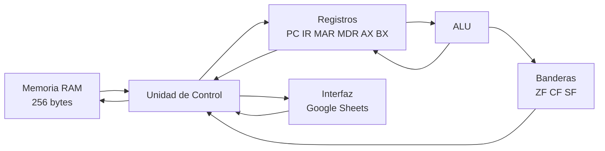

# Simulador de CPU de 8 bits
Simulador interactivo de una CPU de 8 bits basado en la arquitectura de Von Neumann, desarrollado utilizando Google Sheets y Google Apps Script.
El proyecto permite visualizar el funcionamiento de los principales componentes de una CPU y ejecutar instrucciones mediante el ciclo:

**Fetch -> Decode -> Execute -> Store**

---
## Plataforma
El proyecto fue desarrollado usando:
- Google Sheets
- Google Apps Script
- JavaScript
Google Sheets funciona como interfaz visual del simulador, mientras que Google Apps Script implementa la lógica de la CPU, memoria, ALU y unidad de control.

---

## Objetivo
Simular el funcionamiento básico de una CPU de 8 bits, incluyendo memoria principal, registros, ALU, unidad de control, banderas y el ciclo de instrucción Fetch-Decode–Execute–Store.
El simulador permite observar paso a paso los cambios producidos en los registros, banderas y memoria durante la ejecución de un programa.

---

## Arquitectura del simulador
El simulador está dividido en diferentes módulos:
- CPU
- Memoria RAM
- ALU
- Unidad de Control
- Interfaz
- Programa principal
Esta separación permite mantener una arquitectura modular y facilita la modificación de los componentes del simulador.



---

## Memoria RAM
El simulador utiliza una memoria principal de **256 posiciones**, correspondiente al rango de direcciones:
`00H – FFH`

Cada posición almacena un valor de 8 bits:
`00000000 – 11111111`

La memoria se divide visualmente en dos segmentos:
| Rango | Tipo |
|---|---|
| 00H – 7FH | CODE |
| 80H – FFH | DATA |

La memoria puede visualizar los valores en formato hexadecimal, binario y decimal.

Las operaciones principales implementadas son:
- `Read(address)`
- `Write(address, value)`

Los valores almacenados están limitados al rango de 8 bits:
`0 – 255`

---
## Registros del CPU
La CPU utiliza los siguientes registros:

| Registro | Función |
|---|---|
| PC | Program Counter. Indica la dirección de la siguiente instrucción |
| IR | Instruction Register. Representa la instrucción actual |
| MAR | Memory Address Register. Mantiene la dirección utilizada durante el acceso a memoria |
| MDR | Memory Data Register. Representa el dato asociado al acceso a memoria |
| AX | Registro de propósito general y acumulador |
| BX | Registro de propósito general |

Todos los registros utilizan valores de **8 bits**.

---
## Banderas
La CPU implementa tres banderas:

| Bandera | Descripción |
|---|---|
| ZF | Zero Flag. Se activa cuando el resultado es cero |
| CF | Carry Flag. Indica acarreo o préstamo según la operación |
| SF | Sign Flag. Representa el bit más significativo del resultado |

Las banderas son actualizadas por las operaciones correspondientes de la ALU y por instrucciones como `CMP`.

---
## ALU
La Unidad Aritmético-Lógica implementa operaciones aritméticas y lógicas.

### Operaciones aritméticas
- ADD
- SUB
- INC
- DEC

### Operaciones lógicas
- AND
- OR
- XOR
- NOT
- CMP

Los resultados son tratados como valores de 8 bits y las operaciones actualizan las banderas correspondientes.

---
## Ciclo de instrucción
Cada instrucción pasa por cuatro fases:

### FETCH
Obtiene la instrucción indicada por el Program Counter.
Micro-operación representada:
`PC → MAR → MDR → IR; PC++`

### DECODE
La Unidad de Control interpreta el opcode y los operandos de la instrucción.
Ejemplo:
`MOV AX, 5`
se identifica como una instrucción `MOV` con un registro y un valor inmediato.

### EXECUTE
Se ejecuta la operación correspondiente.
Dependiendo de la instrucción, puede intervenir:
- ALU
- registros
- banderas
- memoria
- Program Counter

### STORE
El resultado de la operación es almacenado en el registro o posición de memoria correspondiente.

---

## ISA implementada
El simulador implementa el siguiente conjunto de instrucciones:

| Instrucción | Operandos | Descripción |
|---|---|---|
| MOV | reg, imm | Carga un valor inmediato en un registro |
| MOV | reg, reg | Copia el contenido de un registro a otro |
| LOAD | reg, [dir] | Lee un valor de memoria |
| STORE | [dir], reg | Escribe el contenido de un registro en memoria |
| ADD | reg, reg | Suma dos valores |
| SUB | reg, reg | Resta dos valores |
| INC | reg | Incrementa un registro |
| DEC | reg | Decrementa un registro |
| AND | reg, reg | Operación AND |
| OR | reg, reg | Operación OR |
| XOR | reg, reg | Operación XOR |
| NOT | reg | Operación NOT |
| CMP | reg, reg | Compara dos valores y actualiza las banderas |
| JMP | dir | Salto incondicional |
| JZ | dir | Salta cuando ZF = 1 |
| JNZ | dir | Salta cuando ZF = 0 |
| HLT | — | Detiene la ejecución |

### Representación de instrucciones
La implementación actual utiliza una representación textual de las instrucciones. La Unidad de Control interpreta el mnemonic y sus operandos mediante el decodificador.
Por ejemplo:
```text
MOV AX, 5
INC AX
CMP AX, BX
JNZ 02H
```
Por este motivo, la versión actual no asigna un opcode binario físico a cada instrucción dentro de la RAM. La codificación de instrucciones en bytes constituye una posible ampliación de la arquitectura.

---

## Modos de direccionamiento
El decodificador reconoce diferentes tipos de operandos.

### Registro
```text
AX
BX
```

### Inmediato
```text
5
25
100
```

### Memoria
```text
[80H]
[81H]
```

### Dirección de salto
```text
02H
10H
20H
```

---

## Interfaz
La interfaz se encuentra implementada en Google Sheets.

Permite visualizar:
- registros del CPU;
- banderas;
- fase actual;
- estado del CPU;
- instrucción actual;
- última operación;
- memoria RAM;
- log de micro-operaciones.
La fase actual se resalta visualmente utilizando diferentes colores.

---
## Controles
El simulador dispone de cinco controles principales.

### STEP
Ejecuta una fase del ciclo de instrucción.
Cada pulsación avanza entre:
`FETCH → DECODE → EXECUTE → STORE`

Esto permite observar paso a paso las micro-operaciones realizadas por la CPU.

### RUN
Ejecuta automáticamente las fases del ciclo hasta alcanzar una instrucción `HLT` o el límite de seguridad configurado.

### PAUSE
Pausa la ejecución automática y conserva el estado actual de la CPU.

### RESET
Reinicia:
- registros;
- banderas;
- Program Counter;
- fase actual;
- estado de ejecución;
- log de micro-operaciones.

### LOAD PROGRAM
Reinicia el simulador y prepara el programa de demostración para su ejecución.

---
## Log de micro-operaciones
El simulador registra cronológicamente las operaciones realizadas.
Ejemplo:
```text
FETCH     PC -> MAR -> MDR -> IR; PC++
DECODE    Decodificando: MOV BX, 5
EXECUTE   Ejecutando: MOV BX, 5
STORE     STORE completado: MOV BX, 5
```

Esto permite analizar el funcionamiento interno del ciclo de instrucción.

---

## Programa de demostración

El programa utilizado para demostrar el funcionamiento del simulador es:

```text
00H    MOV AX, 0
01H    MOV BX, 5
02H    INC AX
03H    CMP AX, BX
04H    JNZ 02H
05H    STORE [80H], AX
06H    HLT
```

El objetivo del programa es incrementar `AX` desde 0 hasta 5.

---

## Funcionamiento del programa demo

Inicialmente:

```text
AX = 0
BX = 5
```

Se ejecuta:

```text
INC AX
```

Después:

```text
CMP AX, BX
```

Mientras los registros sean diferentes:

```text
ZF = 0
```

la instrucción:

```text
JNZ 02H
```

modifica el Program Counter y vuelve a ejecutar `INC AX`.

La secuencia produce:

```text
AX = 1 → ZF = 0 → salto
AX = 2 → ZF = 0 → salto
AX = 3 → ZF = 0 → salto
AX = 4 → ZF = 0 → salto
AX = 5 → ZF = 1 → no salta
```

Cuando `AX` alcanza el valor de `BX`, el programa continúa con:

```text
STORE [80H], AX
```

El valor `5` es almacenado en la dirección `80H` de la RAM.

Finalmente:

```text
HLT
```

detiene la CPU.

---

## Resultado final del programa

Después de ejecutar el programa completo se obtiene:

| Elemento | Valor |
|---|---|
| PC | 07H |
| AX | 05H |
| BX | 05H |
| ZF | 1 |
| CF | 0 |
| SF | 0 |
| RAM[80H] | 05H |
| Estado | HALTED |

En memoria:

```text
Dirección: 80H
Decimal:   5
Binario:   00000101
Tipo:      DATA
```

---

## Pruebas realizadas

Durante el desarrollo se realizaron pruebas independientes y de integración.

Se verificó:

- lectura y escritura de RAM;
- validación de direcciones de memoria;
- registros de 8 bits;
- banderas ZF, CF y SF;
- ADD, SUB, INC y DEC;
- AND, OR, XOR y NOT;
- CMP;
- MOV;
- LOAD;
- STORE;
- JMP;
- JZ;
- JNZ;
- HLT;
- persistencia de registros entre ejecuciones;
- ciclo Fetch–Decode–Execute–Store mediante STEP;
- ejecución automática mediante RUN;
- pausa mediante PAUSE;
- reinicio mediante RESET;
- programa demo con bucle;
- escritura final en RAM.

---

## Estructura del proyecto

```text
Simulador-CPU-8-Bits/
│
├── README.md
│
├── docs/
│
└── src/
    ├── Main.gs
    ├── CPU.gs
    ├── Memory.gs
    ├── ALU.gs
    ├── ControlUnit.gs
    └── Interface.gs
```

### CPU.gs

Gestiona los registros y banderas de la CPU.

### Memory.gs

Implementa la memoria RAM y las operaciones de lectura y escritura.

### ALU.gs

Implementa las operaciones aritméticas y lógicas.

### ControlUnit.gs

Implementa el decodificador, ejecución de instrucciones, saltos y almacenamiento de resultados.

### Interface.gs

Gestiona la interfaz visual, controles, log y ejecución paso a paso o automática.

### Main.gs

Contiene pruebas de los componentes y del programa de demostración.

---

## Tecnologías utilizadas
- Google Sheets
- Google Apps Script
- JavaScript
- GitHub
- GitHub Projects
